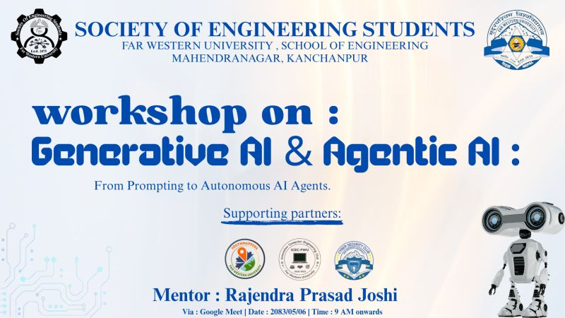

# 🤖 Agentic AI Workshop

<p align="center">
  
</p>

<h3 align="center">Building Autonomous AI Agents with LangGraph</h3>

<p align="center">
  A hands-on workshop on Agentic AI, LangGraph, Multi-Agent Systems, Memory, Human-in-the-Loop, and Production-ready Agent Pipelines.
</p>

<p align="center">
  
  
  
  
  
</p>

---

## 🎓 About the Workshop

This repository contains the **hands-on code, notebooks, and learning materials** used during the **Agentic AI Workshop** organised by the **Society of Engineering Students, Far Western University, School of Engineering, Mahendranagar, Kanchanpur**.

This workshop is a **direct continuation** of the *Generative AI & LangChain Workshop* and takes learners into the heart of **Agentic AI** — building systems where LLMs don't just answer questions but **plan, decide, use tools, and act autonomously** to complete complex tasks.

The learning path progresses through:

```
Agents Recap → LangGraph Fundamentals → StateGraph & Nodes
             → Conditional Edges → Agent Memory & Persistence
             → Human-in-the-Loop → Multi-Agent Systems
             → Supervisor Agents → ReAct Agents → Production Pipelines
```

---

## 🏫 Workshop Details

| Field           | Information                                   |
| --------------- | --------------------------------------------- |
| **Workshop**    | Agentic AI Workshop                           |
| **Theme**       | Building Autonomous AI Agents with LangGraph  |
| **Organiser**   | Society of Engineering Students               |
| **Institution** | Far Western University, School of Engineering |
| **Location**    | Mahendranagar, Kanchanpur                     |
| **Mentor**      | Rajendra Prasad Joshi                         |
| **Mode**        | Online via Google Meet                        |
| **Date**        | 2083/05/07 (BS)                               |
| **Time**        | 9:00 AM onwards                               |

---

## 📁 Repository Structure

```text
📦 Agentic-AI-Workshop/
│
├── 📂 1.agents-recap/
├── 📂 2.langgraph-intro/
├── 📂 3.stategraph-nodes-edges/
├── 📂 4.conditional-edges/
├── 📂 5.agent-memory/
├── 📂 6.persistence-checkpointing/
├── 📂 7.human-in-the-loop/
├── 📂 8.multi-agent-systems/
├── 📂 9.supervisor-agent/
├── 📂 10.react-agent/
├── 📂 11.tool-calling-agents/
├── 📂 12.agentic-rag/
│
├── 📂 assets/
│   └── 🖼️ workshop-poster.png
│
├── 📜 requirements.txt
├── 📜 .gitignore
└── 📜 README.md
```

---

## 📚 Topics Covered

### 1. 🔁 Agents Recap
`📂 1.agents-recap/`

Quick refresher on what was built in the previous workshop.

- What agents are and how they differ from chains
- Tools + LLMs = Agents
- ReAct reasoning loop (Reason → Act → Observe → Repeat)
- Why vanilla LangChain agents have limitations
- Motivation for LangGraph

---

### 2. 🗺️ Introduction to LangGraph
`📂 2.langgraph-intro/`

LangGraph is LangChain's framework for building **stateful, graph-based agent workflows**.

- What LangGraph is and why it exists
- Graphs, nodes, and edges — the mental model
- LangGraph vs. LangChain chains
- When to use LangGraph over a simple agent
- Setting up and running your first graph

---

### 3. 🔷 StateGraph, Nodes & Edges
`📂 3.stategraph-nodes-edges/`

The core building blocks of every LangGraph application.

- Defining a `TypedDict` or Pydantic state schema
- Creating and registering `nodes` (Python functions or LLM calls)
- Connecting nodes with `edges`
- Setting `START` and `END` nodes
- Running a graph with `.invoke()` and `.stream()`

**StateGraph Pattern:**

```python
from langgraph.graph import StateGraph, START, END
from typing import TypedDict

class AgentState(TypedDict):
    messages: list
    next: str

graph = StateGraph(AgentState)
graph.add_node("planner", planner_fn)
graph.add_node("executor", executor_fn)
graph.add_edge(START, "planner")
graph.add_edge("planner", "executor")
graph.add_edge("executor", END)

app = graph.compile()
```

---

### 4. 🔀 Conditional Edges
`📂 4.conditional-edges/`

Giving your agent the power to **make routing decisions** at runtime.

- Why conditional routing is central to agentic behaviour
- `add_conditional_edges()` in LangGraph
- Routing functions that inspect agent state
- Building loops and branching paths

**Conditional Flow:**

```text
         Input
           │
         Node A
           │
     [Router Function]
        /         \
   Condition A   Condition B
       │               │
    Node B           Node C
        \             /
           → END
```

---

### 5. 🧠 Agent Memory
`📂 5.agent-memory/`

Giving agents the ability to remember across steps and turns.

- Types of agent memory: in-context vs. external
- `MessagesState` for conversation tracking
- `add_messages` reducer for message accumulation
- Short-term memory within a session
- Carrying information across graph nodes

---

### 6. 💾 Persistence & Checkpointing
`📂 6.persistence-checkpointing/`

Making agent state **durable** — surviving restarts, enabling replay, and supporting long-running workflows.

- What checkpointing is and why agents need it
- LangGraph `MemorySaver` and `SqliteSaver`
- Thread IDs and conversation scoping
- Replaying from a checkpoint
- Persistence patterns for production agents

```python
from langgraph.checkpoint.memory import MemorySaver

checkpointer = MemorySaver()
app = graph.compile(checkpointer=checkpointer)

config = {"configurable": {"thread_id": "session-42"}}
result = app.invoke({"messages": [...]}, config=config)
```

---

### 7. 🙋 Human-in-the-Loop (HITL)
`📂 7.human-in-the-loop/`

Pausing agent execution to **ask a human for approval, input, or correction**.

- Why autonomous agents still need human oversight
- `interrupt_before` and `interrupt_after` in LangGraph
- Approving or rejecting tool calls
- Injecting human feedback mid-graph
- Resuming execution after human input
- Safety-critical applications of HITL

**HITL Pattern:**

```text
Agent starts
      ↓
  Tool Call Proposed
      ↓
  ⏸ PAUSE (Human reviews)
      ↓
  ✅ Approved / ❌ Rejected
      ↓
  Agent resumes or re-plans
```

---

### 8. 🕸️ Multi-Agent Systems
`📂 8.multi-agent-systems/`

Building systems where **multiple specialised agents collaborate** to solve complex tasks.

- Why a single agent isn't always enough
- Decomposing tasks across specialised sub-agents
- Agent communication and state sharing
- Orchestrating agents as nodes in LangGraph
- Parallel vs. sequential agent execution

**Multi-Agent Architecture:**

```text
                  Orchestrator
                      │
         ┌────────────┼────────────┐
         ▼            ▼            ▼
    Research       Writer       Reviewer
     Agent         Agent         Agent
         │            │            │
         └────────────┴────────────┘
                      │
                  Final Output
```

---

### 9. 👨‍💼 Supervisor Agent
`📂 9.supervisor-agent/`

A **Supervisor** is a controller agent that dynamically routes tasks to the right sub-agent.

- The Supervisor pattern in multi-agent systems
- Supervisor as a router node in LangGraph
- Dynamic task assignment based on agent descriptions
- Feedback loops: sub-agents reporting back to the Supervisor
- Termination conditions

```text
User Query
    ↓
Supervisor (LLM decides who to call)
    ├──→ Research Agent
    ├──→ Coding Agent
    ├──→ Calculator Agent
    └──→ END (task complete)
```

---

### 10. ⚛️ ReAct Agents
`📂 10.react-agent/`

The foundational **Reasoning + Acting** pattern that powers most modern AI agents.

- ReAct: Reason → Act → Observe → Repeat
- How the ReAct loop runs inside LangGraph
- `create_react_agent()` from `langgraph.prebuilt`
- Custom tool execution within the loop
- Handling errors and retrying in the loop
- Tracing and debugging ReAct agent steps

**ReAct Loop:**

```text
    User Input
         │
         ▼
    [REASON]  ← LLM thinks about what to do
         │
         ▼
    [ACT]     ← LLM calls a Tool
         │
         ▼
    [OBSERVE] ← Tool result injected back
         │
         ▼
    Repeat or → [FINAL ANSWER]
```

---

### 11. 🔧 Tool-Calling Agents
`📂 11.tool-calling-agents/`

Building agents that **autonomously decide which tools to call and when**.

- Tool schemas and function descriptions
- Multi-tool agents: search, calculator, code executor
- Tool result processing and re-planning
- Error handling in tool execution
- Combining multiple tools in a single agent loop

---

### 12. 🔍 Agentic RAG
`📂 12.agentic-rag/`

Combining **Retrieval-Augmented Generation** with **agentic reasoning** for smarter question answering.

- Why standard RAG falls short for complex queries
- RAG as a tool inside an agent loop
- Iterative retrieval: retrieve → reason → retrieve again
- Self-RAG: agent grades its own retrieved documents
- Corrective RAG: agent rewrites queries when retrieval fails

**Agentic RAG Flow:**

```text
User Question
      ↓
  [Agent Reasons]
      ↓
  Calls Retriever Tool
      ↓
  [Grade Documents]
      ↓
  Relevant? ──Yes──→ Generate Answer
      │
      No
      │
  [Rewrite Query]
      ↓
  Calls Retriever Again
      ↓
  Generate Answer
```

---

## 🧠 Overall Learning Path

```text
                  AGENTIC AI
                      │
                      ▼
               Agents Recap
                      │
                      ▼
            LangGraph Fundamentals
                      │
                      ▼
        StateGraph + Nodes + Edges
                      │
                      ▼
            Conditional Routing
                      │
                      ▼
              Agent Memory
                      │
                      ▼
         Persistence & Checkpointing
                      │
                      ▼
           Human-in-the-Loop
                      │
             ┌─────────┴──────────┐
             ▼                    ▼
       Multi-Agent           ReAct Agents
       Systems                    │
             │              Tool-Calling
       Supervisor                 │
         Agent              Agentic RAG
             │                    │
             └─────────┬──────────┘
                        ▼
               🤖 Production-Ready
                  Agentic AI Systems
```

---

## 🛠️ Installation & Setup

### 1. Clone the Repository

```bash
git clone https://github.com/Rajendra-Pd-Joshi/Agentic-AI-Workshop.git
cd Agentic-AI-Workshop
```

### 2. Create a Virtual Environment

**Windows:**
```bash
python -m venv venv
venv\Scripts\activate
```

**Linux / macOS:**
```bash
python3 -m venv venv
source venv/bin/activate
```

### 3. Install Dependencies

```bash
pip install -r requirements.txt
```

The `requirements.txt` includes:

```text
langchain
langchain-openai
langchain-community
langgraph
python-dotenv
streamlit
pypdf
```

### 4. Configure Environment Variables

Create a `.env` file in the root directory:

```env
OPENAI_API_KEY=your_openai_api_key_here
```

> ⚠️ Never commit your `.env` file or expose API keys publicly. The `.gitignore` is already configured to exclude it.

---

## 📖 Recommended Learning Order

Follow the numbered folders in sequence for the best learning experience:

```
1.  Agents Recap              → Reconnect with the previous workshop
2.  LangGraph Intro           → Understand the graph-based agent model
3.  StateGraph, Nodes, Edges  → Master the core LangGraph primitives
4.  Conditional Edges         → Add decision-making to your graphs
5.  Agent Memory              → Give agents short-term memory
6.  Persistence               → Make agents durable and resumable
7.  Human-in-the-Loop         → Build safe, human-supervised agents
8.  Multi-Agent Systems       → Orchestrate teams of specialised agents
9.  Supervisor Agent          → Build a dynamic task-routing controller
10. ReAct Agents              → Implement the core reasoning loop
11. Tool-Calling Agents       → Connect agents to real-world functions
12. Agentic RAG               → Build an intelligent retrieval system
```

---

## 🎯 Workshop Goal

The primary goal was to guide learners into the **modern Agentic AI stack** — from a simple agent loop to a fully autonomous, multi-agent system:

```
Simple ReAct Agent
      ↓
Graph-Based Agent (LangGraph)
      ↓
Stateful Agent with Memory
      ↓
Persistent, Resumable Agent
      ↓
Human-Supervised Agent (HITL)
      ↓
Multi-Agent Collaborative System
      ↓
🚀 Production-Ready Agentic AI
```

---

## 🧰 Technologies & Concepts

| Category            | Tools / Concepts                                  |
| ------------------- | ------------------------------------------------- |
| **Language**        | Python 3.10+                                      |
| **Agent Framework** | LangGraph, LangChain Agents                       |
| **LLM Providers**   | OpenAI (GPT models)                               |
| **Embeddings**      | OpenAI Embeddings, LangChain Embedding interfaces |
| **Vector Stores**   | FAISS / Chroma (via `langchain-community`)        |
| **Memory**          | `MemorySaver`, `SqliteSaver`, `MessagesState`     |
| **RAG**             | Agentic RAG, Self-RAG, Corrective RAG             |
| **Agent Patterns**  | ReAct, Supervisor, Multi-Agent, Human-in-the-Loop |
| **UI**              | Streamlit                                         |
| **Env Management**  | `python-dotenv`                                   |

---

## 🔗 References

- [LangGraph Documentation](https://langchain-ai.github.io/langgraph/)
- [LangGraph Tutorials](https://langchain-ai.github.io/langgraph/tutorials/)
- [LangChain Documentation](https://python.langchain.com/)
- [LangGraph Prebuilt Agents](https://langchain-ai.github.io/langgraph/reference/prebuilt/)
- [LangGraph Human-in-the-Loop](https://langchain-ai.github.io/langgraph/concepts/human_in_the_loop/)
- [LangGraph Multi-Agent](https://langchain-ai.github.io/langgraph/concepts/multi_agent/)
- [OpenAI API Docs](https://platform.openai.com/docs/)

---

## 👨‍🏫 Mentor

**Rajendra Prasad Joshi**
Junior AI/ML Engineer | Agentic AI Intern at Alba Connect Co., Ltd. (Tokyo)
B.Tech Computer Science, VIT Vellore | CGPA 9.08/10
COMPEX Scholar — Indian Embassy, Kathmandu

*Agentic AI Workshop*
Society of Engineering Students
Far Western University, School of Engineering — Mahendranagar, Kanchanpur

---

## 🙏 Acknowledgement

This repository contains educational materials and hands-on implementations prepared for the **Agentic AI Workshop**. It is intended as a practical learning resource for students and developers exploring the foundations of **Agentic AI, LangGraph, Multi-Agent Systems, Memory, Human-in-the-Loop, and Production-ready Agent Pipelines**.

This workshop is the second in a series — if you haven't already, check out the [GenAI & LangChain Workshop](https://github.com/Rajendra-Pd-Joshi/GenAI-Langchain-Workshop) first.

---

## ⭐ Support the Repository

If this workshop material helped you learn something new, consider giving it a ⭐ on GitHub — it helps others discover the resource too.

**Happy Learning & Building! 🚀🤖**